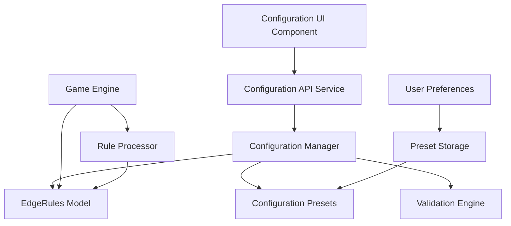
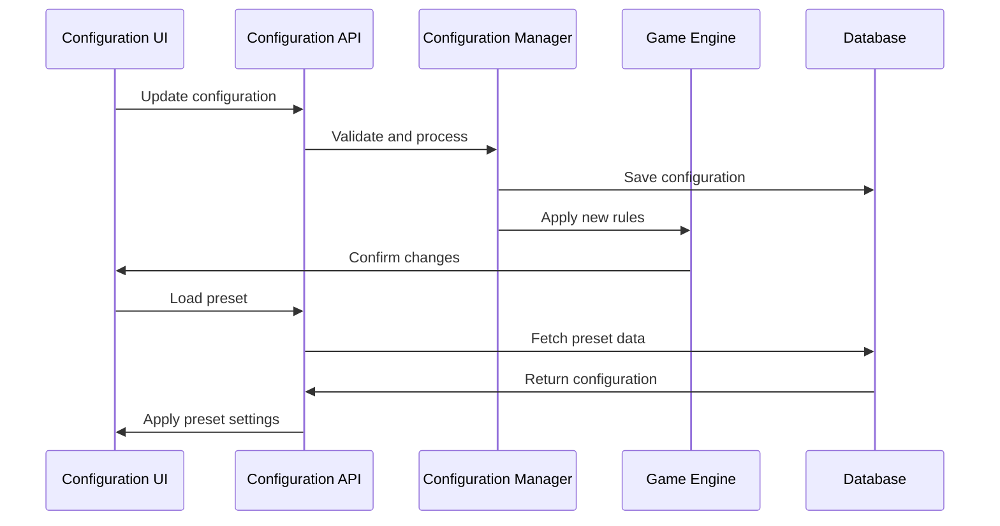

# Design Document

## Overview

The Monopoly Deal Configuration System will extend the existing `EdgeRules` model to provide a comprehensive, user-friendly interface for managing game rule variations. The system will include a configuration management service, a React-based UI component, preset management, and integration with the game engine to ensure all edge cases are handled consistently.

## Architecture

### Component Architecture



### Data Flow



## Components and Interfaces

### 1. Enhanced EdgeRules Model

Extend the existing `EdgeRules` model with additional configuration options and validation:

```python
class BuildingForfeitureRule(str, Enum):
    DISCARD = "discard"
    TO_BANK = "to_bank"
    KEEP_FLOATING = "keep_floating"

class PropertyMergingRule(str, Enum):
    AUTO_MERGE = "auto_merge"
    MANUAL_MERGE = "manual_merge"
    NO_MERGE = "no_merge"

class EdgeRules(BaseModel):
    # Existing rules (already implemented)
    housePayment: HousePaymentRule = HousePaymentRule.BANK
    hotelMove: HotelMoveRule = HotelMoveRule.NOT_ALLOWED
    deckExhaustion: DeckExhaustionRule = DeckExhaustionRule.RESHUFFLE
    extraProperties: ExtraPropertiesRule = ExtraPropertiesRule.CAP_RENT
    
    # Enhanced rules for edge cases
    buildingForfeiture: BuildingForfeitureRule = BuildingForfeitureRule.DISCARD
    propertyMerging: PropertyMergingRule = PropertyMergingRule.AUTO_MERGE
    quadrupleRent: bool = False
    forcedDealToDealBreaker: bool = True
    justSayNoEmptyHand: bool = True
    justSayNoOnZero: bool = True
    
    # Rule descriptions for UI
    def get_rule_descriptions(self) -> Dict[str, str]:
        return {
            "housePayment": "How house/hotel cards are handled when received by players without complete sets",
            "hotelMove": "Whether house/hotel cards can be moved between property sets",
            "deckExhaustion": "What happens when the deck runs out of cards",
            "extraProperties": "How extra property cards beyond complete sets are handled",
            "buildingForfeiture": "What happens to buildings when property sets become incomplete",
            "propertyMerging": "Whether separate property sets of the same color can be merged",
            "quadrupleRent": "Whether two 'Double the Rent' cards can be played together",
            "forcedDealToDealBreaker": "Whether Forced Deal can be used to set up Deal Breaker combos",
            "justSayNoEmptyHand": "Whether 'Just Say No' can be played from an empty hand",
            "justSayNoOnZero": "Whether 'Just Say No' can block zero-cost actions"
        }
```

### 2. Configuration Manager Service

```python
class ConfigurationManager:
    def __init__(self):
        self.default_rules = EdgeRules()
        self.validation_engine = RuleValidationEngine()
    
    def validate_configuration(self, rules: EdgeRules) -> ValidationResult:
        """Validate rule combinations for consistency"""
        
    def apply_configuration(self, game_engine: MonopolyDealEngine, rules: EdgeRules):
        """Apply configuration to game engine"""
        
    def get_preset_configurations(self) -> List[ConfigurationPreset]:
        """Get available rule presets"""
        
    def save_custom_preset(self, name: str, rules: EdgeRules, user_id: Optional[int] = None):
        """Save custom configuration preset"""
```

### 3. Configuration Presets

```python
class ConfigurationPreset(BaseModel):
    id: str
    name: str
    description: str
    rules: EdgeRules
    is_official: bool = False
    created_by: Optional[int] = None
    usage_count: int = 0
    
    class Config:
        json_schema_extra = {
            "example": {
                "id": "strict_official",
                "name": "Strict Official Rules",
                "description": "Conservative interpretation following official rules closely",
                "is_official": True,
                "usage_count": 1250
            }
        }

# Predefined presets
OFFICIAL_PRESETS = {
    "strict_official": ConfigurationPreset(
        id="strict_official",
        name="Strict Official Rules",
        description="Conservative interpretation of official rules",
        rules=EdgeRules(
            housePayment=HousePaymentRule.BANK,
            hotelMove=HotelMoveRule.NOT_ALLOWED,
            deckExhaustion=DeckExhaustionRule.RESHUFFLE,
            extraProperties=ExtraPropertiesRule.CAP_RENT,
            buildingForfeiture=BuildingForfeitureRule.DISCARD,
            propertyMerging=PropertyMergingRule.AUTO_MERGE,
            quadrupleRent=False,
            forcedDealToDealBreaker=False,
            justSayNoEmptyHand=False,
            justSayNoOnZero=False
        ),
        is_official=True
    ),
    
    "flexible_house_rules": ConfigurationPreset(
        id="flexible_house_rules",
        name="Flexible House Rules",
        description="More permissive rules allowing advanced strategies",
        rules=EdgeRules(
            housePayment=HousePaymentRule.FLOATING,
            hotelMove=HotelMoveRule.COSTS_ACTION,
            deckExhaustion=DeckExhaustionRule.RESHUFFLE,
            extraProperties=ExtraPropertiesRule.SPLIT_SETS,
            buildingForfeiture=BuildingForfeitureRule.TO_BANK,
            propertyMerging=PropertyMergingRule.MANUAL_MERGE,
            quadrupleRent=True,
            forcedDealToDealBreaker=True,
            justSayNoEmptyHand=True,
            justSayNoOnZero=True
        ),
        is_official=False
    )
}
```

### 4. Rule Validation Engine

```python
class RuleValidationEngine:
    def validate_rules(self, rules: EdgeRules) -> ValidationResult:
        """Validate rule combinations for logical consistency"""
        errors = []
        warnings = []
        
        # Check for conflicting rules
        if rules.hotelMove == HotelMoveRule.FREE_MOVE and rules.buildingForfeiture == BuildingForfeitureRule.KEEP_FLOATING:
            warnings.append("Free building movement with floating forfeiture may create complex edge cases")
        
        # Check for performance implications
        if rules.extraProperties == ExtraPropertiesRule.SPLIT_SETS and rules.propertyMerging == PropertyMergingRule.AUTO_MERGE:
            warnings.append("Auto-merging with split sets may cause frequent recalculations")
        
        return ValidationResult(
            is_valid=len(errors) == 0,
            errors=errors,
            warnings=warnings
        )

class ValidationResult(BaseModel):
    is_valid: bool
    errors: List[str]
    warnings: List[str]
```

### 5. React Configuration Component

```typescript
interface ConfigurationPanelProps {
  currentRules: EdgeRules;
  onRulesChange: (rules: EdgeRules) => void;
  presets: ConfigurationPreset[];
}

const ConfigurationPanel: React.FC<ConfigurationPanelProps> = ({
  currentRules,
  onRulesChange,
  presets
}) => {
  const [selectedPreset, setSelectedPreset] = useState<string>('');
  const [customRules, setCustomRules] = useState<EdgeRules>(currentRules);
  const [validationResult, setValidationResult] = useState<ValidationResult | null>(null);

  // Component implementation with sections for:
  // - Preset selection dropdown
  // - Rule category tabs (Building Rules, Property Rules, Action Rules, etc.)
  // - Individual rule toggles and selectors
  // - Validation feedback
  // - Save/Load custom presets
  // - Export/Import functionality
};
```

## Data Models

### Configuration Storage

```python
class ConfigurationPreset(Base):
    __tablename__ = "configuration_presets"
    
    id = Column(String, primary_key=True)
    name = Column(String, nullable=False)
    description = Column(String)
    rules_json = Column(JSON, nullable=False)
    is_official = Column(Boolean, default=False)
    created_by = Column(Integer, ForeignKey("users.id"), nullable=True)
    created_at = Column(DateTime(timezone=True), server_default=func.now())
    usage_count = Column(Integer, default=0)
    
    creator = relationship("User", back_populates="configuration_presets")

class UserConfiguration(Base):
    __tablename__ = "user_configurations"
    
    id = Column(Integer, primary_key=True)
    user_id = Column(Integer, ForeignKey("users.id"))
    preset_id = Column(String, ForeignKey("configuration_presets.id"))
    is_default = Column(Boolean, default=False)
    last_used = Column(DateTime(timezone=True), server_default=func.now())
    
    user = relationship("User", back_populates="configurations")
    preset = relationship("ConfigurationPreset")
```

## Error Handling

### Validation Errors

```python
class ConfigurationError(Exception):
    """Base exception for configuration errors"""
    pass

class InvalidRuleCombinationError(ConfigurationError):
    """Raised when rule combinations are logically inconsistent"""
    pass

class PresetNotFoundError(ConfigurationError):
    """Raised when requested preset doesn't exist"""
    pass
```

### Error Response Format

```python
class ConfigurationErrorResponse(BaseModel):
    error_type: str
    message: str
    invalid_rules: List[str]
    suggestions: List[str]
```

## Testing Strategy

### Unit Tests

1. **Rule Validation Tests**
   - Test all valid rule combinations
   - Test invalid combinations and error handling
   - Test edge cases and boundary conditions

2. **Configuration Manager Tests**
   - Test preset loading and saving
   - Test configuration application to game engine
   - Test validation integration

3. **Game Engine Integration Tests**
   - Test each rule's effect on game logic
   - Test rule interactions during gameplay
   - Test performance with different configurations

### Integration Tests

1. **API Endpoint Tests**
   - Test configuration CRUD operations
   - Test preset management endpoints
   - Test validation endpoint responses

2. **UI Component Tests**
   - Test configuration panel interactions
   - Test preset selection and application
   - Test validation feedback display

### Performance Tests

1. **Rule Processing Performance**
   - Benchmark rule validation speed
   - Test configuration application overhead
   - Test memory usage with complex rule sets

2. **Database Performance**
   - Test preset loading times
   - Test configuration save/load performance
   - Test concurrent access scenarios

## Implementation Phases

### Phase 1: Core Configuration System
- Extend EdgeRules model with new rule types
- Implement ConfigurationManager service
- Create rule validation engine
- Add database models for preset storage

### Phase 2: Preset Management
- Implement predefined official presets
- Add custom preset save/load functionality
- Create preset sharing and import/export
- Add usage analytics for presets

### Phase 3: UI Integration
- Create React configuration panel component
- Implement rule category organization
- Add validation feedback and help text
- Create preset selection interface

### Phase 4: Game Engine Integration
- Update game engine to use configuration rules
- Implement rule-specific game logic
- Add configuration-aware AI recommendations
- Test all rule combinations in gameplay

### Phase 5: Advanced Features
- Add configuration templates for different play styles
- Implement rule conflict detection and resolution
- Create configuration sharing between users
- Add analytics on rule popularity and effectiveness